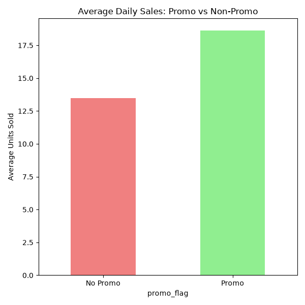
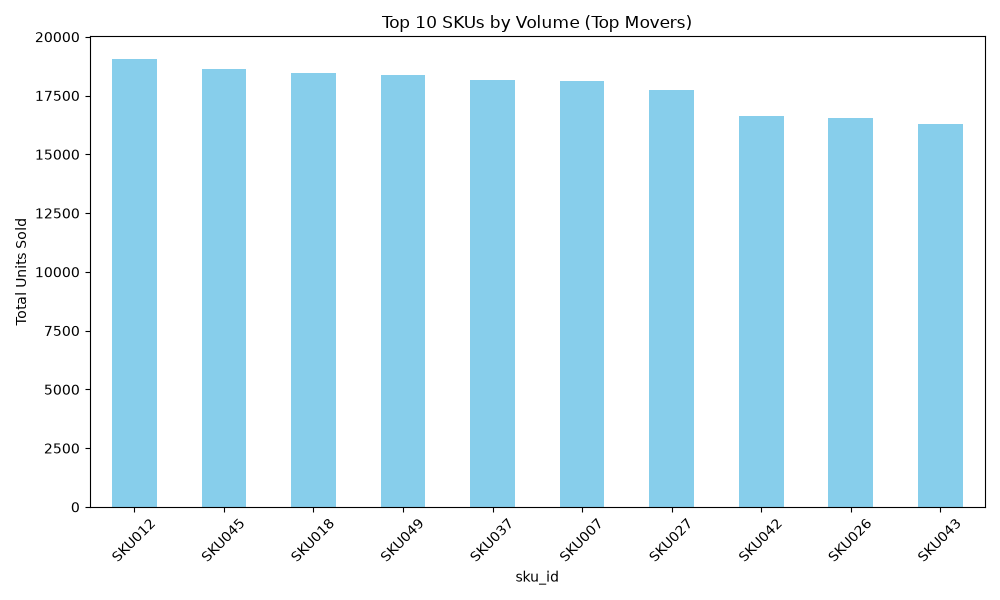
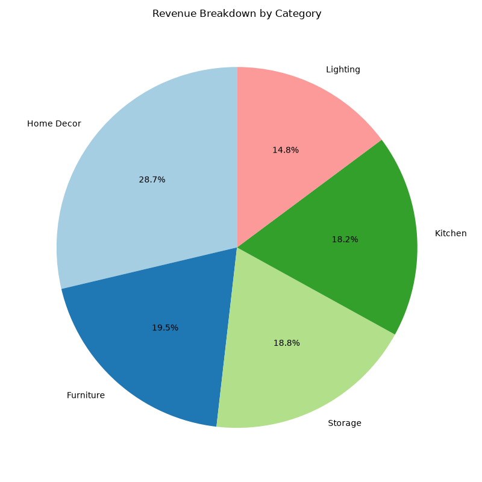
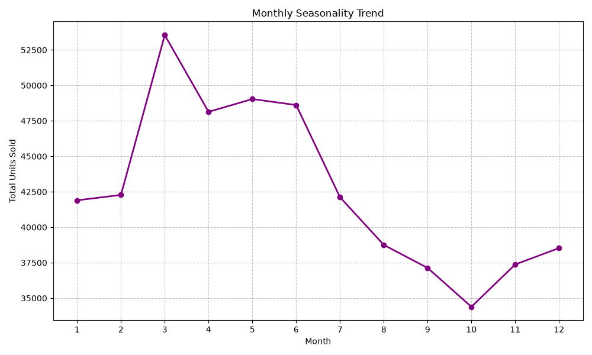

# Exploratory Data Analysis (EDA) Memo

## Business Insights

### 1. Promo Effectiveness
Promotions drive a **38.1% lift** in average daily units sold compared to non-promotional days. This indicates high price sensitivity.

### 2. Product Concentration (Top Movers vs Dead Stock)
The top-selling SKU (SKU012) sold 19,067 units, vastly outperforming the bottom-tier SKUs like SKU004 (3,380 units). This suggests opportunities to rationalise dead stock.

### 3. Category Revenue Drivers
The **Home Decor** category generates the highest total revenue (₹888,468,077.72), making it the most critical category for inventory protection.

### 4. Seasonality
Month 3 shows the highest sales volume, pointing to strong seasonal demand peaks that must be anticipated in our supply chain.

---
*Note: An accompanying EDA notebook (`notebooks/01_eda.ipynb`) contains the working analysis code and interactive Plotly visuals.*